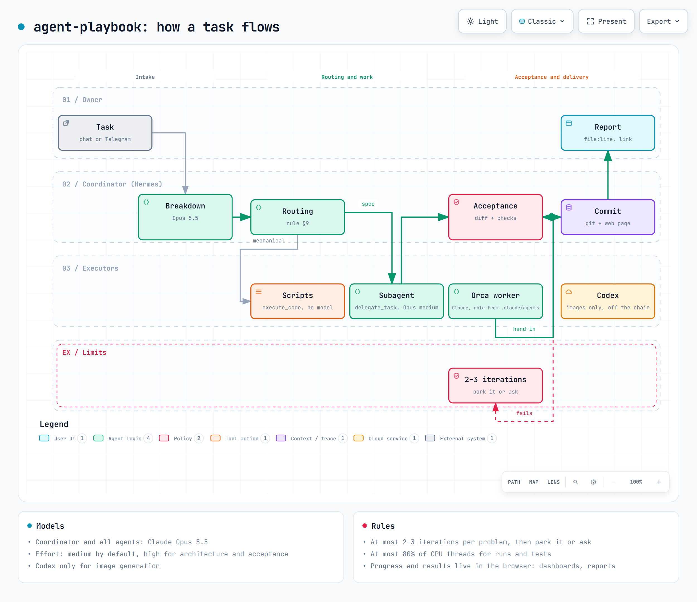
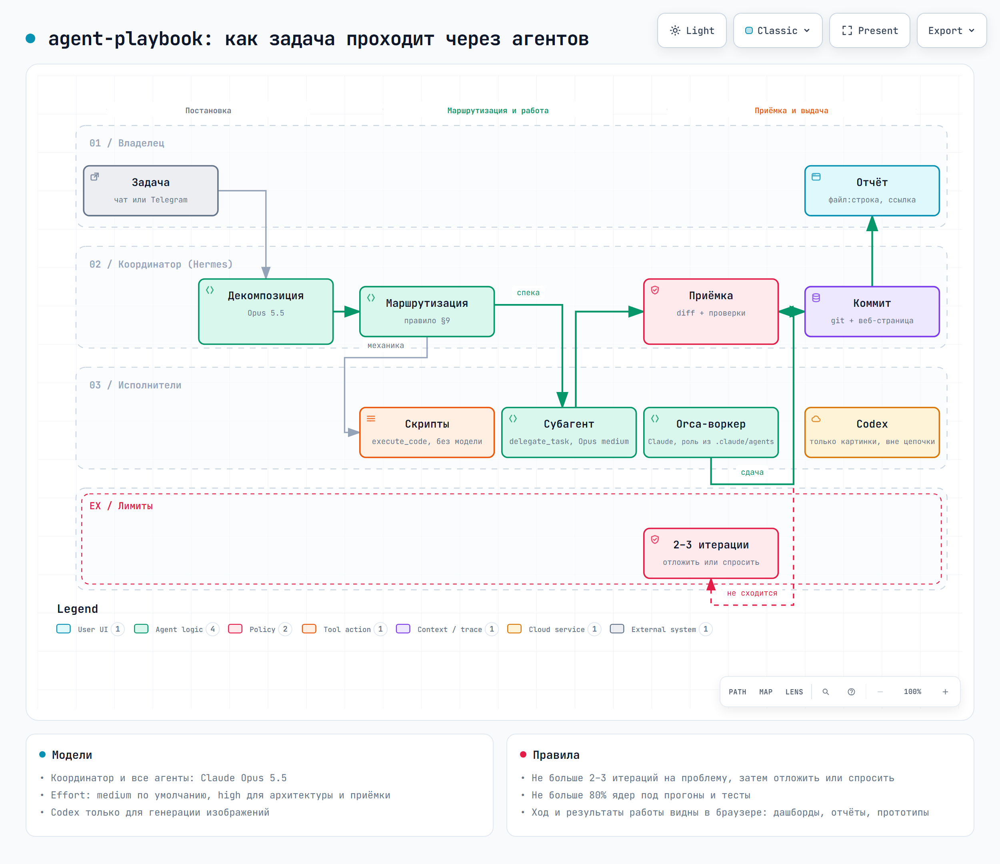

# agent-playbook

**[English](#english) · [Русский](#русский)**

---

## English

A playbook for running AI coding agents across projects: global rules, model routing, delegation to
workers (Orca, Hermes `delegate_task`), acceptance of their work, and **visualising the work in the
browser**: live dashboards for long runs, analytical report pages with charts, and clickable
prototypes and diagrams. The owner sees what the agents are doing and what they produced without
reading raw logs. Distilled from hands-on work across dozens of projects.

Harnesses: [Hermes Agent](https://hermes-agent.nousresearch.com), Claude Code, Codex.

### How it works



The owner sets a task. The coordinator (Hermes on Claude Opus 5.5) breaks it down and picks an executor
from the routing table in `global/GLOBAL_RULES.md` §9:

| Work | Executor |
|---|---|
| mechanical: search, counting, running checks | scripts (`execute_code`), no model |
| recon, aggregation, edits from a complete spec | subagent `delegate_task`, Opus 5.5 medium |
| architecture, hard edits, acceptance review, hard bugs | Orca worker, Claude Opus 5.5 high |
| a role with a profile in `.claude/agents/*.md` | Orca worker with that profile |
| image generation | Codex |

A worker's report is a self-report, not a fact. The coordinator checks the diff and runs the project's
validation, then commits and reports back with `file:line` evidence. Anything the owner should look
at goes to a web page: a live monitor of simulation runs, an analytical report with charts and
decision cards, or a playable UI prototype. The page is served inside a private network (Tailscale
tailnet) and is checked for HTTP 200 and with a headless-browser screenshot before the link is sent.
If a problem is not solved in 2–3 iterations, the agent parks it or brings it to the owner (§12).

Interactive diagram (search, focus, relationship tracing, export): download
`docs/how-it-works.en.html` and open it in a browser. Source: `docs/how-it-works.en.workflow.json`,
built with [Archify](https://github.com/tt-a1i/archify).

### Contents

| Path | What | Installed to |
|---|---|---|
| `global/GLOBAL_RULES.md` | global rules: principles, language and tone, model routing (§9), project layout (§10), iteration cap (§12), CPU cap (§13), results as web pages (§14), worker context economy (§15) | `~/.agents/GLOBAL_RULES.md` + symlinks from `%LOCALAPPDATA%\hermes\SOUL.md`, `~/.claude/CLAUDE.md`, `~/.codex/AGENTS.md` |
| `skills/<category>/<name>` | global Hermes skills | `%LOCALAPPDATA%\hermes\skills\` |
| `project-template/` | skeleton of a new project: `CLAUDE.md`, studio process, roles, task queue | root of a new repository |

Key skills: `agent-delegation-and-verification` (spec, self-report check, acceptance),
`orca-worker-routing` (Codex/Claude workers via Orca), `agent-cost-monitoring` (token cost vs
estimate), `browser-page-preview` (dashboards, reports and prototypes as web pages),
`agent-project-setup` and `agent-harness-config` (one set of rules and skills for all harnesses),
`game-*` (preproduction, balance simulations, UI prototypes). The skills and rules are written in
Russian; the commands, paths and code in them are language-neutral.

### Before you use it

This is a personal working configuration published as an example. Replace the placeholders
`<OWNER_CHAT_ID>` and `<tailnet>`, the machine names (`minipc`, `powerpc-1`), the `C:\Users\user\…`
paths and the CPU limits with your own. No secrets are stored here: bot tokens and API keys live in
each project's `.env`.

Install (Windows, git-bash) and new-project steps: see the Russian section below or
`skills/autonomous-ai-agents/agent-project-setup/SKILL.md`.

### License

[MIT](LICENSE). Third-party skill packs (`caveman`, `ponytail`, `archify`, Orca `orchestration`) are
not included and are distributed under their own licenses.

---

## Русский

Шаблон поведения агентов для всех проектов: глобальные правила, маршрутизация моделей, делегирование
воркерам (Orca, `delegate_task`), приёмка их работы и **визуализация работы в браузере**: живые
дашборды долгих прогонов, аналитические страницы отчётов с графиками, кликабельные прототипы и схемы.
Владелец видит, что делают агенты и что получилось, не читая сырые логи. Собран на базе работы
над десятками проектов.

### Как это работает



Владелец ставит задачу. Координатор (Hermes, Claude Opus 5.5) раскладывает её и выбирает исполнителя
по таблице §9 `global/GLOBAL_RULES.md`: механику делают скрипты без модели, работу по готовой спеке —
субагент `delegate_task`, архитектуру и сложные правки — Orca-воркер Claude с профилем роли,
картинки — Codex.

Самоотчёт исполнителя не считается фактом: координатор сверяет diff и прогоняет проверки проекта,
затем коммитит и отдаёт отчёт со ссылками `файл:строка`. Всё, что владелец должен посмотреть, выходит
веб-страницей: монитор прогонов симуляции, аналитический отчёт с графиками и развилками карточками,
прототип экрана. Страница публикуется внутри закрытой сети (Tailscale tailnet); перед выдачей ссылки
проверяются код 200 и скриншот headless-браузером. Если проблема не решается за 2–3 итерации, её
откладывают или несут владельцу (§12).

Интерактивная схема (поиск, фокус, трассировка связей, экспорт) — скачайте `docs/how-it-works.html`
и откройте в браузере. Исходник — `docs/how-it-works.workflow.json`, собран
[Archify](https://github.com/tt-a1i/archify):
`node bin/archify.mjs deliver workflow docs/how-it-works.workflow.json docs/how-it-works.html --quality showcase`.

### Состав

| Путь | Что | Куда ставится |
|---|---|---|
| `global/GLOBAL_RULES.md` | глобальные правила: принципы, язык и тон, маршрутизация моделей (§9), раскладка проекта (§10), лимит итераций (§12), CPU (§13), результаты веб-страницами (§14), экономия контекста воркеров (§15) | `~/.agents/GLOBAL_RULES.md` + симлинки `%LOCALAPPDATA%\hermes\SOUL.md`, `~/.claude/CLAUDE.md`, `~/.codex/AGENTS.md` |
| `skills/<категория>/<имя>` | глобальные навыки Hermes (см. ниже) | `%LOCALAPPDATA%\hermes\skills\` |
| `project-template/` | каркас нового проекта: `CLAUDE.md`, процесс студии, роли, очередь задач | корень нового репозитория |

#### Навыки

| Навык | Когда |
|---|---|
| `agent-delegation-and-verification` | спека воркеру, проверка самоотчёта, приёмка, интеграция волны |
| `orca-worker-routing` | запуск Codex/Claude-воркеров через Orca, их цикл и ловушки |
| `agent-cost-monitoring` | цена блока в токенах, факт против оценки |
| `agent-project-setup` | новый проект: CLAUDE.md, `.claude/skills`, симлинки, доверие харнессов |
| `agent-harness-config` | единые правила и навыки в Hermes, Claude Code, Codex |
| `agent-settings-migration` | перенос настроек Hermes на другую машину |
| `hermes-gateway-ops`, `hermes-tool-backend-setup` | Telegram-шлюз, веб-бэкенды Hermes |
| `browser-page-preview` | дашборды, отчёты, прототипы и мониторы прогонов веб-страницами |
| `git-branch-integration` | сведение веток воркеров в master |
| `design-decision-interview` | закрытие развилок владельца по одной через `clarify` |
| `codex-web-search`, `video-transcript-research` | исследования |
| `game-*`, `3d-asset-generation` | игровые проекты: препродакшн, баланс-симуляции, прототипы UI, 3D |

Сторонние пакеты (`caveman`, `ponytail`, `archify`, Orca `orchestration`) не вендорятся — ставятся
из источников по `skills/autonomous-ai-agents/agent-project-setup/references/third-party-skill-packs.md`.

### Установка на машину (Windows, git-bash)

```bash
git clone https://github.com/wCELENw/agent-playbook ~/agent-playbook
cp ~/agent-playbook/global/GLOBAL_RULES.md ~/.agents/GLOBAL_RULES.md
# симлинки (Developer Mode): SOUL.md, ~/.claude/CLAUDE.md, ~/.codex/AGENTS.md -> ~/.agents/GLOBAL_RULES.md
cp -r ~/agent-playbook/skills/* "$LOCALAPPDATA/hermes/skills/"
# ранняя автосводка Claude Code (правило 15): env в ~/.claude/settings.json
python -c "import json,pathlib;p=pathlib.Path.home()/'.claude/settings.json';d=json.loads(p.read_text('utf-8')) if p.exists() else {};d.setdefault('env',{})['CLAUDE_CODE_AUTO_COMPACT_WINDOW']='300000';p.write_text(json.dumps(d,indent=2,ensure_ascii=False),'utf-8')"
```

Подробно, с проверкой загрузки в каждом харнессе, — `skills/autonomous-ai-agents/agent-project-setup/SKILL.md`.
Машинно-специфичные строки (хосты, chat_id, пути, модели) правятся под машину после копирования.

### Новый проект

1. Скопировать `project-template/` в корень репозитория, заполнить `CLAUDE.md`.
2. Роли проекта — `.claude/agents/<роль>.md` по образцу `architect`/`doc-keeper`/`qa-tester`
   (модель и effort во frontmatter), зоны — в таблицу `docs/studio/STUDIO.md` §2.
3. `MSYS=winsymlinks:nativestrict ln -s ../.claude/skills .agents/skills`, `hermes skills trust .`.

### Обновление

Канон — рабочие файлы на машине (`~/.agents`, `%LOCALAPPDATA%\hermes\skills`). После правки навыка
или правил — скопировать в репозиторий, заменить личные данные плейсхолдерами и закоммитить.

### Перед использованием

Это личная рабочая конфигурация, выложенная как пример. Плейсхолдеры `<OWNER_CHAT_ID>`, `<tailnet>`,
имена машин (`minipc`, `powerpc-1`), пути `C:\Users\user\…` и лимиты CPU замените на свои.
Секретов в репозитории нет: токены ботов и ключи API хранятся в `.env` проектов и сюда не попадают.

### Лицензия

[MIT](LICENSE) — используйте, меняйте и распространяйте свободно, сохраняя уведомление об авторстве.
Сторонние пакеты навыков (`caveman`, `ponytail`, `archify`, Orca `orchestration`) сюда не входят и
распространяются по своим лицензиям из своих репозиториев.
